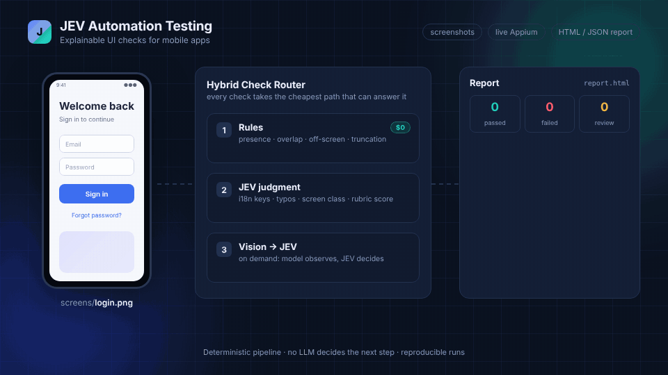

# JEV Automation Testing

   

**Mobile UI testing with explainable verdicts — not just red and green.**

JEV Automation Testing checks your app's screens with [JEV](https://docs.typesafe.ai/), TypeSafe's judgment engine. Every pass or fail comes with a **confidence score and readable evidence**, so you know *why* a screen failed.



▶️ **[Watch the 75-second demo video](docs/assets/jev-demo.mp4)**

---

## Why use it

- **Explainable results.** Each verdict includes confidence, probabilities and evidence, e.g. *"title shows the raw i18n key `login.title`"*.
- **No silent mistakes.** Anything below **0.75 confidence** becomes `NEEDS_REVIEW` instead of a wrong pass/fail.
- **Low cost.** Free rule checks run first. AI is used only when needed, and duplicate images are judged once.
- **Reproducible.** A deterministic pipeline: your code stays in control, no LLM decides the next step.
- **Flexible.** Works with screenshot folders *or* live Appium runs, and with any multimodal model (Ollama, OpenRouter, Claude, OpenAI-compatible).

## How it works

```
Screenshot (+ UI tree) ──► 1. Rules        free: presence, overlap, off-screen, truncation
                           2. JEV          i18n keys, typos, screen class, rubric scores
                           3. Vision → JEV on demand: the model describes, JEV decides
                       ──► Confidence gate (0.75) ──► report.html + report.json
```

Each check takes the cheapest path that can answer it.

## Installation

Requirements: **Python 3.12** and **[uv](https://docs.astral.sh/uv/)**.

```bash
git clone https://github.com/vankhangfet/jev-automation-testing.git
cd jev-automation-testing
uv sync
uv run pytest        # 154 tests, fully offline: no device or API key needed
```

Set your API keys (see `.env.example`; `.env` is not loaded automatically):

```bash
export TYPESAFE_API_KEY=...                    # JEV, from console.typesafe.ai
# Vision model: pick one
export LLM_URL=http://localhost:11434/v1       # any OpenAI/Anthropic-style endpoint
export MODEL_NAME=qwen2.5-vl                   # must be multimodal
# or: export ANTHROPIC_API_KEY=...             # uses Claude Haiku
```

## Quick start (offline, no device)

See a full run with the bundled fake driver:

```bash
uv run python -m jev_ui_agent run --flow flows/demo_fake.yaml \
  --driver fake --policy config/policy.fake.yaml --fixtures-dir tests/fixtures/fake_run
```

Open `reports/run-*/report.html`. The fixtures include a planted `login.title` i18n bug, which JEV flags when `TYPESAFE_API_KEY` is set.

---

## Usage

### Mode 1: Check a folder of screenshots

No device needed. Write rules in plain English:

```yaml
# rules/common.yaml
name: common_checks
rules:
  - id: no_raw_keys
    instruction: "No raw translation keys (like 'login.title') are visible"
  - id: content_loaded
    instruction: "No spinners or skeleton placeholders are visible"
  - id: text_quality
    type: score          # 5-level rubric instead of yes/no
    instruction: "Texts are clear and well-written"
    pass_at: 0.75        # optional, default 0.75
```

Run it:

```bash
uv run python -m jev_ui_agent check-screenshots --dir screens --rules rules/common.yaml
# Run check-...: 3 images - 1 pass, 1 fail, 1 review, 0 error
```

Useful flags: `--out reports/login`, `--workers 4`, `--limit 50`, `--no-recursive`, `--resume <run-dir>` (continue an interrupted run without paying again).

**Tips:** describe things that are visible on screen, be specific (`"a button labeled 'Sign in'"`), and write rules in English for the best accuracy.

**Try it now:** [`demo/`](demo/) contains 5 ready-made login screenshots (4 with planted defects) plus matching rules — see [demo/README.md](demo/README.md).

### Mode 2: Live UI automation (Appium)

Describe the user journey. At each `checkpoint`, the agent captures a screenshot and UI tree, then runs 5 check groups (functional, layout, content quality, error/anomaly, visual) into a weighted screen score.

```yaml
# flows/my_flow.yaml
name: login_smoke
app: com.example.app
platform: android
steps:
  - action: launch
  - checkpoint: home
  - action: tap
    target: "acc-id:Sign in"
  - checkpoint: login_form
  - action: input
    target: "acc-id:Email"
    value: "demo@example.com"
  - action: tap
    target: "acc-id:Submit"
  - checkpoint: after_submit
```

```bash
appium &                                    # start the Appium server
uv run python -m jev_ui_agent run --flow flows/my_flow.yaml --driver android
```

- Selectors: `res-id:`, `acc-id:`, `text:`, `xpath:`. Actions: `launch`, `tap`, `input`, `swipe`.
- Device capabilities live in `config/devices.yaml`; functional expectations and weights in `config/policy.yaml`.
- Full Android setup (Appium, JDK 17, emulator): [scripts/setup_android.md](scripts/setup_android.md).

---

## Reports

Each run creates `reports/<run-id>/` with:

| File | Content |
|---|---|
| `report.html` | Summary, failing screens first, verdict + confidence + evidence per check |
| `report.json` | Same data for CI |
| `checkpoint.jsonl` | Progress log (Mode 1), used by `--resume` |

Exit codes: `0` all passed · `1` a check failed or an image errored · `2` configuration error.

## Configuration

| Item | Purpose |
|---|---|
| `TYPESAFE_API_KEY` | JEV engine. Missing → JEV checks are `SKIPPED` |
| `LLM_URL` + `MODEL_NAME` (+ `LLM_API_KEY`, `LLM_STYLE`) | Any multimodal vision endpoint (takes priority) |
| `ANTHROPIC_API_KEY` | Fallback vision source (Claude Haiku) |
| `config/policy.yaml` | Weights, confidence gate, toggles, functional expectations |
| `config/devices.yaml` | Appium capabilities per platform |
| `src/jev_ui_agent/jev/questions.py` | The JEV question bank: one file to read and tune |

## Roadmap

- ✅ Hybrid pipeline (rules + JEV + vision), HTML/JSON reports, fake driver, Android Appium
- ✅ Batch screenshot checking with natural-language rules, any-LLM vision
- 🔜 iOS driver (XCUITest), Figma design comparison
- 🔮 Exploratory mode

## Learn more

- [Design specs](docs/superpowers/specs/) and [implementation plans](docs/superpowers/plans/)
- [Android E2E runbook](scripts/setup_android.md)
- Demo animation and video sources: [docs/assets/src/](docs/assets/src/) (HTML scenes rendered with Playwright + ffmpeg)

## License

[MIT](LICENSE)
